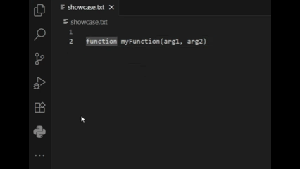

# quick-brackets README

A simple extension that adds a `{}` snippet for creating code blocks smartly and quickly.

## Features

This extension activates when the cursor is inside a closing parenthesis `(|)` and the right arrow key is pressed. It inserts a `{$0}` snippet, placing the cursor inside the new braces.

### When It Works

The snippet is inserted for statements that require a code block, including:

* Control flow statements: `if()`, `for()`, `while()`, `switch()`
* Function declarations: `function myFunction(arg){}`
* Anonymous functions: `setTimeout(function(){})`
* Class constructors: `constructor(){}`

### When It Doesn't Work

The snippet will not be inserted, and the right arrow key will behave normally in the following situations:

* For standard function or method calls: `myFunction()`, `console.log()`
* If a code block `{}` already exists after the parentheses.
* If the user has highlighted text (i.e., the selection is not empty).
* For class method definitions that are not the `constructor` (e.g., `myMethod(){}`). This is an intentional limitation to prevent incorrect activation on standard function calls.

## Requirements

There are no external requirements or dependencies for this extension.

## Extension Settings

This extension does not contribute any settings.

## Known Issues

* The logic that detects keywords like `function` or `if` may incorrectly trigger if those keywords appear inside a plain string or a comment on the same line. This is a deliberate choice for enabling the feature for anonymous functions.

## Release Notes

### 1.0.0

Initial release of Quick Brackets.
* Adds smart `{}` snippet insertion on right-arrow key press for control flow statements, function declarations, and constructors.